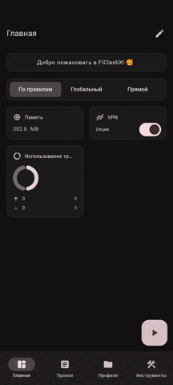

# FlClashX

[**English**](README_EN.md)

[](https://github.com/Leon4rdik/FlClashX/releases)
[](https://github.com/Leon4rdik/FlClashX/releases)
[](LICENSE)

FlClashX - мультиплатформенный прокси-клиент на базе FlClash и Mihomo/Clash.Meta. Проект ориентирован на быстрый запуск туннельного VPN, удобное управление профилями и стабильную работу на Android, Windows, macOS и Linux.

## Загрузка

Готовые сборки публикуются в разделе [Releases](https://github.com/Leon4rdik/FlClashX/releases).

<a href="https://github.com/Leon4rdik/FlClashX/releases"></a>

## Что добавлено

- Поддержка `xhttp` для VLESS-профилей и туннельного VPN.
- Импорт `vless://` ссылок с преобразованием в совместимый Mihomo YAML-профиль.
- Передача `xhttp-opts`: path, host, mode, headers, padding и дополнительные параметры транспорта.
- Обновление Mihomo core до версии `v1.19.27`.
- Поддержка Reality/TLS параметров при импорте proxy URI.
- Настройки TUN, системного прокси, профилей, виджетов и расширенной информации о подписке.

## Интерфейс

Десктопный вид:

<p align="center">
    
</p>

Мобильный вид:

<p align="center">
    
</p>

## Платформы

| Платформа | Форматы |
| --- | --- |
| Android | APK universal, ARMv8, ARMv7, x86_64 |
| Windows | setup exe, portable zip |
| macOS | DMG для Apple Silicon и Intel |
| Linux | AppImage, deb, rpm |

## Поддержка xHTTP

FlClashX умеет принимать VLESS-ссылки с `type=xhttp` или `network=xhttp` и сохранять их как локальный профиль. Это позволяет использовать современные xHTTP-конфигурации без ручного редактирования YAML.

Пример параметров, которые сохраняются при импорте:

```text
type=xhttp
path=/proxy
host=example.com
mode=auto
security=reality
pbk=...
sid=...
fp=chrome
sni=example.com
```

## Сборка

```bash
flutter pub get
dart setup.dart windows --arch amd64
flutter build windows --release
```

Для других платформ используются те же команды `dart setup.dart <platform>` и стандартные команды Flutter build. Полная автоматическая сборка описана в `.github/workflows/build.yaml`.

## Проект

- Исходный код: [Leon4rdik/FlClashX](https://github.com/Leon4rdik/FlClashX)
- Релизы: [github.com/Leon4rdik/FlClashX/releases](https://github.com/Leon4rdik/FlClashX/releases)
- Лицензия: [LICENSE](LICENSE)
